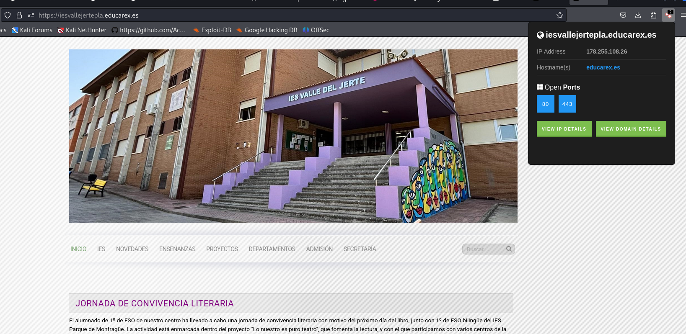
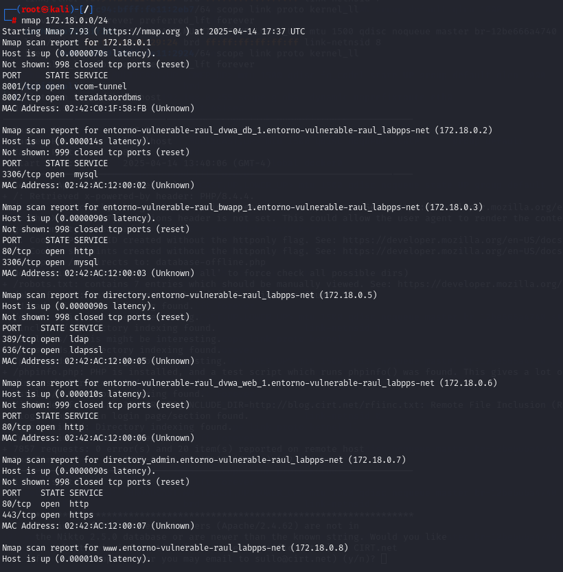

# PPS-Unidad3Actividad2-RaulAlbalatPerez
Unidad 3 - Actividad 2. Detección de equipos, puertos, servicios,vulnerabilidades.
---
## ACTIVIDADES A REALIZAR
- Busca información de:
  - Como podemos obtener información pública con protocolo whois, web DoaminTools y DSNrecon.
    Información pública: `whois`, DomainTools y `dnsrecon`

    - **WHOIS**: Es una herramienta que permite consultar información sobre el propietario de un dominio o una dirección IP.
        **Comando WHOIS** (en Kali o Linux):

    ```bash
    whois [dominio_o_ip]
    ```
    - **DomainTools**: Plataforma en línea que proporciona información detallada sobre dominios, como registros históricos, propietarios, etc. Puedes buscar en [https://www.domaintools.com/](https://www.domaintools.com/).

    - **DNSRecon**: Herramienta para obtener información de registros DNS de un dominio. Algunos comandos básicos:

    ```bash
    dnsrecon -d [dominio]
    ```

- Cómo podemos utilizar Nmap y nikto,   para buscar equipos, puertos abiertos, servicios, vulnerabilidades.
    - **Nmap**: Herramienta para escanear puertos, identificar servicios y detectar vulnerabilidades. Algunos ejemplos de comandos:
        - Escaneo básico de puertos:
            ```bash
            nmap [IP o dominio]
            ```
        - Escaneo de puertos con detección de servicios:
            ```bash
            nmap -sV [IP o dominio]
            ```
        - Detección de sistema operativo:
            ```bash
            nmap -O [IP o dominio]
            ```
        - Escaneo de vulnerabilidades con scripts de Nmap (ver más abajo).
    
    - **Nikto**: Escáner de vulnerabilidades web para identificar configuraciones incorrectas y vulnerabilidades comunes en servidores web.
        - Comando básico para escanear un servidor web:
            ```bash
            nikto -h [http://dominio_o_ip]
            ```
- Cómo utilizar Wfuzz, Dirb para localizar recursos web en servidores.
    - **Wfuzz**: Herramienta para fuzzing en aplicaciones web. Se utiliza para identificar directorios y archivos ocultos.
        - Ejemplo de comando básico para fuzzing de directorios:
            ```bash
              wfuzz -c -w /ruta/a/wordlist.txt -u http://[dominio]/FUZZ
            ```
    - **Dirb**: Herramienta similar a Wfuzz para buscar recursos en aplicaciones web.
        - Ejemplo de comando básico para buscar directorios:
            ```bash
            dirb http://[dominio]
            ```
- Que scripts que podemos utilizar con Nmap para la búsqueda de vulnerabilidades.
    - **Nmap Scripting Engine (NSE)**: Nmap tiene un conjunto de scripts predefinidos para detectar vulnerabilidades.
    - Para ver la lista de scripts disponibles, puedes consultar:
        ```bash
        nmap --script-help
        ```
    - Para ejecutar un script de vulnerabilidad, por ejemplo:
        ```bash
        nmap --script=vuln [IP]
        ```


- Cómo podemos buscar información de explotación de vulnerabilidades con searchsploit
    - **Searchsploit** es una herramienta que proporciona acceso a la base de datos de Exploit-DB, donde puedes encontrar exploits disponibles para vulnerabilidades    conocidas.
        - Comando básico para buscar exploits para Linux con Kernel 5:
            ```bash
            searchsploit linux kernel 5
            ```

- Instala en tu navegador la extensión de Shodan y muestra la información que tenemos tanto de ip, como de dominio del sitio http://iesvalledeljerteplasencia.es 
    1. Para automatizar la búsqueda o realizar consultas avanzadas, podemos usar la API de Shodan desde Kali Linux.Pasa ello nos vamos a la página de [Shodan](https://www. shodan.io/)  y como ya estamos registrados obtenenmos la cogemos nuestra API key . 
      
    2. Instalamos la extension de  Shodan en nuestro navegador.Para ello nos vamos a la parte superior derecha del navegador firefox y pinchamos en el logo con forma de piez de puzle añadimos la extension de shodan. 

      

    3. Pulsamos en Añadir a firefox

      
    4. Ya tenemos guardada la extensión de Shodan.

        
    5. En le navegador buscamos http://iesvalledeljerteplasencia.es  y nos aparece la extension de shodan indicadonos los puertos abiertos.
     
         
       
      

- Sobre la red del laboratorio PPS con kali, bWAPP, Multidillae y DVWA:<
    Lo primero que hacemos es arranca el el multicontenedor con los diferentes servicios.Desde el kali realizare las siguientes operaciones para resolver los ejercicios más adelante.
     
    Para ello ejecuto un `docker exec -it entorno-vulnerable-raul_kali_1 /bin/bash`del kali . y ya estaría dentro del kali.
     

	- Ayudándote del fichero docker-compose localiza las diferentes máquinas y puertos que deberían de tener abiertos.
	- ## Identifica los equipos de la Red con Nmap.
    Para  identificar los equipos  hacemos un escaneo del dominio 
        ```
        nmap [172.18.0.0/24]
        ```
    
     

    Del resultado de la consulta, obtenemos las direcciones IP de las diferentes servicios. Así como los puertos abiertos.
    hacemos un escaneo más profundo para ver puertos y servicios de la ip 172.18.0.6  y 172.18.0.8 para ver los diferentes resultados.
    -  ## Realiza análisis de puertos en las MV.
    Escaneo de puertos con detección de servicios:
            ```bash
            nmap -sV [IP o dominio]
            ```
         

	
     
	- ## Encuentra los Servicios y Sistemas Operativos de las MV.
    - Detección de sistema operativo:
            ```bash
            nmap -O [IP o dominio]
          
            ```
         


	- ## Inspecciona los puertos con nikto.
        Comando básico para escanear un servidor web:
            ```bash
            nikto -h [http://dominio_o_ip]
            ```
        

        

	- ## Busca las vulnerabilidades de las MV con los scripts de Nmap.
        Comando para script de vulnerabilidades de Nmap
            ```bash
            nmap --script=vuln [IP]
            ```
        

        

	- ## Localiza los servicios web que tienen las diferentes máquinas (Wfuzz y Dirb).
    Uso Dirb para descubrir recursos ocultos. con el comando.
            ```bash
            dirb http://<<IP>> /usr/share/dirb/wordlists/common.txt
            ```
        

    Vemos que tenemos una ruta de la ``database`` obtenida de Dirb. Podemos hacer una ataque por fuerza bruta con Wfuzz para intentar obtener la contraseña.
    Para ello uso el comando :
           ```bash
           wfuzz -c -z file,/usr/share/wordlist/dirb/common.txt -u http://<<IP>>/FUZZ
           ```
        
        


	- ## Utiliza el comando searchsploit para buscar información de explotación de vulnerabilidades presentes en linux con kernel 5
      
        

---	
## ENTREGA

>__Realiza las operaciones indicadas__

>__Crea un repositorio  con nombre PPS-Unidad3Actividad2-Tu-Nombre donde documentes la realización de ellos.__

> No te olvides de documentarlo convenientemente con explicaciones, capturas de pantalla, etc.

>__Sube a la plataforma, tanto el repositorio comprimido como la dirección https a tu repositorio de Github.__
